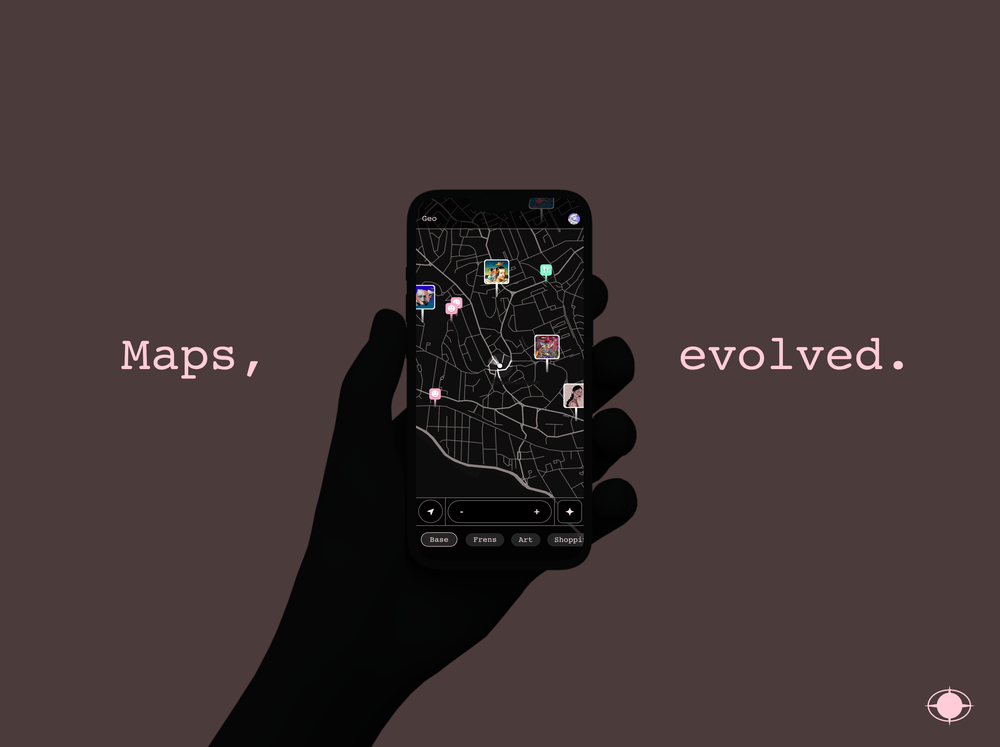

## Geo

This is a landing page for Geo, a collaborative maps app and platform, powered by Solana, as well as a playground to experiment with potential technologies for it.

I've been experimenting with map technologies for a while, but it was thanks to Solana and this hackathon that I finally found the right time and ecosystem to build the navigation tool of my dreams, and hopefully that of others as well.

Development is currently mobile-first. See: https://github.com/saniagarciadev/geo-app

Geo uses Spling to give users access to an exportable and composable social protocol with their Solana wallets.

For Grizzlython, I've also been working on a web-app version: https://github.com/saniagarciadev/frens

Functionality in both of this versions is at the time of writing quite limited, but this is just the beginning!

Geo will be modular and endlessly customizable. Spling allows me to add social features to the map layers That need it.

Others in the Solana ecosystem will be able to use Geo as a platform to add web3 maps to their apps and services for free.

Closed alpha on Android coming 31 March.

Follow on Twitter to stay up to date and get early access: https://twitter.com/mapsyourway
